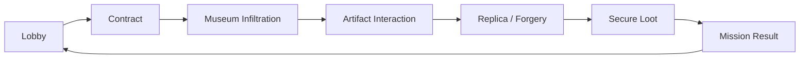

# Museum Heist

> **현재 개발 중인 Unreal Engine 5.8 / C++ 기반 협동 멀티플레이 잠입 게임입니다.**  
> 박물관에 침투해 목표 전시품을 확인하고, 복제품을 제작·교체한 뒤 팀 단위 계약 결과로 이어지는 플레이 루프를 개발하고 있습니다.

## Development Status

**Active Development**

현재 게임 규칙, 네트워크 흐름, UI, 데이터 구조와 밸런스는 계속 변경될 수 있습니다.  
이 저장소는 출시 빌드나 완성된 포트폴리오 결과물이 아니라, 실제 플레이 가능한 협동 게임을 목표로 개발 중인 Current Project입니다.

구현 완료 여부와 검증 상태는 README에 고정하지 않고 개발 상태 문서와 테스트 기록에서 관리합니다.

---

## Project Direction

현재는 다음 구간이 하나의 Multiplayer Session 안에서 자연스럽게 이어지고, 미션 종료 후 다시 Lobby와 다음 게임으로 복귀할 수 있도록 전체 흐름을 정리하고 있습니다.

- Lobby와 Multiplayer Session 흐름
- Contract, 목표 전시품과 Loot 결과 처리
- Painting Forgery와 Object Replica 제작
- Guard AI, Alert와 상호작용 규칙
- Gameplay UI와 Input Mode 전환
- Mission Result와 Lobby Return

---

## Development Environment

- Unreal Engine 5.8
- C++ / Blueprint
- Online Subsystem / Steam
- StateTree
- UMG / MVVM
- OpenCV

---

## Project Documents

- [`CURRENT_PROJECT_STATUS.md`](CURRENT_PROJECT_STATUS.md) — 현재 개발 상태와 검증 기록
- [`LOCAL_PROGRESS_INBOX.md`](LOCAL_PROGRESS_INBOX.md) — 로컬 작업 및 미반영 진행 기록
- [`AGENTS.md`](AGENTS.md) — 프로젝트 구조와 구현 규칙
- [`Museum_Heist_GDD.docx`](Museum_Heist_GDD.docx) — 게임 디자인 문서
- [`Museum_Heist_TDD.docx`](Museum_Heist_TDD.docx) — 기술 설계 문서

---

## Notice

프로젝트는 현재 개발 중이며, 코드·에셋·문서 구조는 진행 상황에 따라 변경될 수 있습니다.
